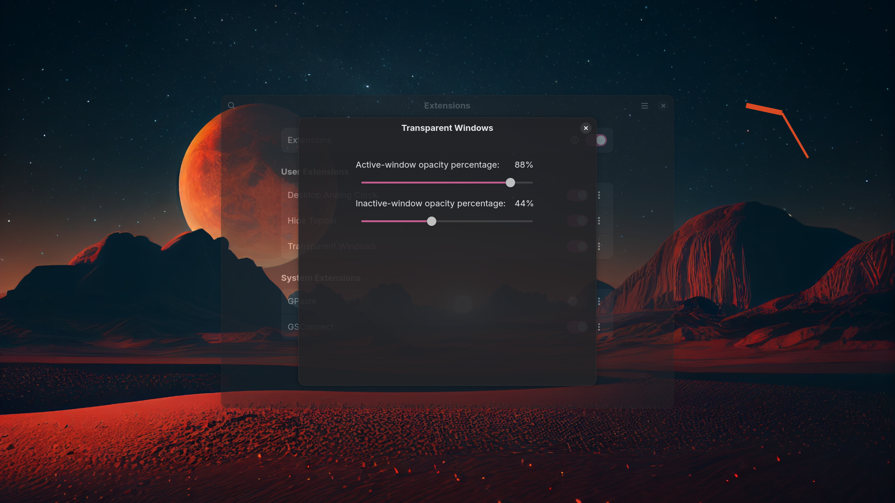

2025December13

# GNOME Transparent Windows

### Intro

GNOME extension to set active, inactive windows' transparancy. Compatible with GNOME 45+
The first opening of every window is fully opaque, it is the default behavior of the extension, **transparency is activated when focus changes between windows.** Also, fullscreen is always fully opaque. I do not feel that i am using Linux unless the windows r transparent.

### Installation

The easiest way to install this extension is via the [GNOME Shell Extensions](https://extensions.gnome.org/) website.

### Manual Installation

For manual installation, you need to have **git** and **glib** installed on your system.

```bash

git clone https://github.com/sonersg/gnome-transparent-windows

mv gnome-transparent-windows gnome-transparent-windows@sonersg.com

mv gnome-transparent-windows@sonersg.com ~/.local/share/gnome-shell/extensions/

glib-compile-schemas ~/.local/share/gnome-shell/extensions/gnome-transparent-windows@sonersg.com/schemas

gnome-extensions enable gnome-transparent-windows@sonersg.com

```

#### To Compile Schema with NIX Package Manager

```bash
nix-shell -p glib --run "glib-compile-schemas ~/.local/share/gnome-shell/extensions/gnome-transparent-windows@sonersg.com/schemas"

```

⚠️ **You may have to log out and in!**

### Preview


